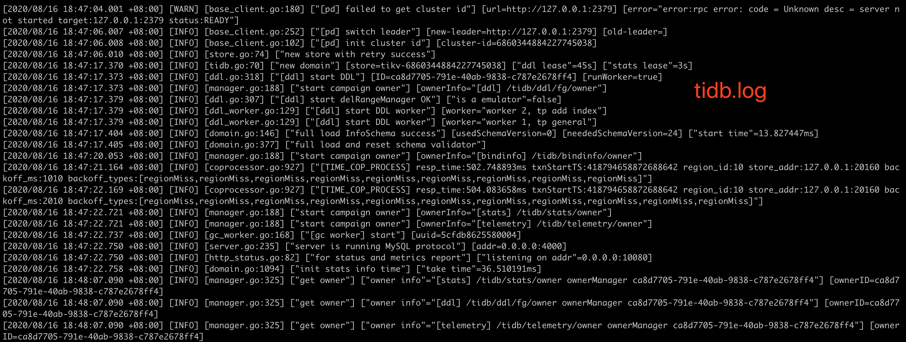
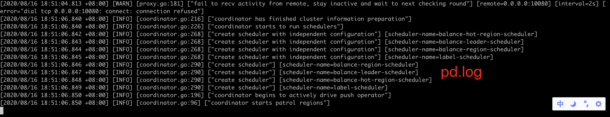
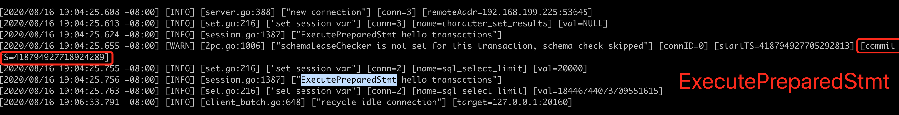

#### 源码编译并部署tidb、tikv

编译部署环境：centos7、git1.8、make3.82、cmake3.14.5

##### 安装配置golang

```shell
cd ~
wget https://golang.org/dl/go1.15.linux-amd64.tar.gz
tar -C /usr/local -xzf go1.15.linux-amd64.tar.gz
vim /etc/profile
# 在最后增加一行
export PATH=$PATH:/usr/local/go/bin
source /etc/profile
go env
# 配置goproxy
go env -w GO111MODULE=on
go env -w GOPROXY=https://goproxy.io,direct
```

##### 安装配置rust

```
cd ~
curl --proto '=https' --tlsv1.2 -sSf https://sh.rustup.rs | sh
vim /etc/profile
# 在最后增加一行
export PATH=$HOME/.cargo/bin:$PATH
source /etc/profile
rustc --version
rustup --version
cargo --version
# centos7 cmake版本较低，重装cmake
yum remove cmake
wget https://github.com/Kitware/CMake/releases/download/v3.14.5/cmake-3.14.5-Linux-x86_64.tar.gz
tar -zxvf cmake-3.14.5-Linux-x86_64.tar.gz
mv cmake-3.14.5-Linux-x86_64 /usr/local/cmake
vim /etc/profile
# 在最后增加一行
export PATH=$PATH:/usr/local/cmake/bin
source /etc/profile
cmake -version
yum install gcc gcc-c++
```


##### 下载源代码

```shell
mkdir -p ~/go/src
go clone git clone https://github.com/pingcap/pd.git
go clone git clone //github.com/pingcap/tidb.git
go clone https://github.com/tikv/tikv.git
```

##### 编译pd并启动验证

```shell
cd ~/go/src/pd
make build
cd bin/
nohup ./pd-server --data-dir=pd --log-file=pd.log &
# 查看2379端口
netstat -anp | grep 2379

# [root@binginx-centos bin]# netstat -anp | grep 2379
# tcp        0      0 127.0.0.1:2379          0.0.0.0:*               LISTEN      4777/./pd-server
```

##### 编译tikv并启动验证

```
cd ~/go/src/tikv
cargo build
cd target/debug/
nohup ./tikv-server --pd-endpoints="127.0.0.1:2379" --addr="127.0.0.1:20160" --data-dir=tikv1 --log-file=tikv1.log &

# 查看20160端口
netstat -anp | grep 20160

# [root@binginx-centos debug]# netstat -anp | grep 20160
# tcp        0      0 127.0.0.1:20160         0.0.0.0:*               LISTEN      5623/./tikv-server
```

##### 编译tidb并启动验证

```
cd ~/go/src/tidb
make
cd bin
nohup ./tidb-server --store=tikv --path="127.0.0.1:2379"  --log-file=tidb.log &

# 查看4000端口
netstat -anp | grep 4000

# [root@binginx-centos bin]# netstat -anp | grep 4000
# tcp6       0      0 :::4000                 :::*                    LISTEN      6006/./tidb-server
```

##### 启动1pd1tidb3tikv

```
# 方便启停，新建start.sh与stop.sh
cd ~/go/src
vim start.sh
# cd ~/go/src/pd/bin
# nohup ./pd-server --data-dir=pd --log-file=pd.log &
# cd ~/go/src/tikv/target/debug/
# nohup ./tikv-server --pd-endpoints="127.0.0.1:2379" --addr="127.0.0.1:20160" --data-dir=tikv1 --log-file=tikv1.log &
# nohup ./tikv-server --pd-endpoints="127.0.0.1:2379" --addr="127.0.0.1:20161" --data-dir=tikv2 --log-file=tikv2.log &
# nohup ./tikv-server --pd-endpoints="127.0.0.1:2379" --addr="127.0.0.1:20162" --data-dir=tikv3 --log-file=tikv3.log &
# cd ~/go/src/tidb/bin
# nohup ./tidb-server --store=tikv --path="127.0.0.1:2379"  --log-file=tidb.log &
vim stop.sh
# ps -ef | grep tidb-server |awk '{split($2,a);print a[1]}' | xargs kill -9
# ps -ef | grep tikv-server |grep 20160 |awk '{split($2,a);print a[1]}' | xargs kill -9
# ps -ef | grep tikv-server |grep 20161 |awk '{split($2,a);print a[1]}' | xargs kill -9
# ps -ef | grep tikv-server |grep 20162 |awk '{split($2,a);print a[1]}' | xargs kill -9
# ps -ef | grep pd-server |awk '{split($2,a);print a[1]}' | xargs kill -9
chmod +x start.sh stop.sh
./start.sh
ps -ef | grep server
# root      6732     1  2 18:45 pts/0    00:00:00 ./pd-server --data-dir=pd --log-file=pd.log
# root      6733     1  3 18:45 pts/0    00:00:00 ./tikv-server --pd-endpoints=127.0.0.1:2379 --addr=127.0.0.1:20160 --data-dir=tikv1 --log-file=tikv1.log
# root      6734     1  3 18:45 pts/0    00:00:00 ./tikv-server --pd-endpoints=127.0.0.1:2379 --addr=127.0.0.1:20161 --data-dir=tikv2 --log-file=tikv2.log
# root      6735     1  3 18:45 pts/0    00:00:00 ./tikv-server --pd-endpoints=127.0.0.1:2379 --addr=127.0.0.1:20162 --data-dir=tikv3 --log-file=tikv3.log
# root      6736     1  0 18:45 pts/0    00:00:00 ./tidb-server --store=tikv --path=127.0.0.1:2379 --log-file=tidb.log
```






#### 改写源代码，事务启动时，打印日志

1. 寻找事务启动的过程中分别尝试了store/kv.go、store/tikv/txn.go中的Commit实现，都没成功，而且加上之后后台线程一直在不停地打印"hello transaction"

2. 通过test尝试找到了session.go的ExecutePreparedStmt实现，加上日志，写入数据，查看tidb的日志，感觉事务启动是在2pc.go中

   ```
   // ExecutePreparedStmt executes a prepared statement.
   func (s *session) ExecutePreparedStmt(ctx context.Context, stmtID uint32, args []types.Datum) (sqlexec.RecordSet, error) {
   	logutil.BgLogger().Info("ExecutePreparedStmt hello transactions")
   	s.PrepareTxnCtx(ctx)
   	var err error
   	s.sessionVars.StartTime = time.Now()
   	preparedPointer, ok := s.sessionVars.PreparedStmts[stmtID]
   	if !ok {
   		err = plannercore.ErrStmtNotFound
   		logutil.Logger(ctx).Error("prepared statement not found", zap.Uint32("stmtID", stmtID))
   		return nil, err
   	}
   	preparedStmt, ok := preparedPointer.(*plannercore.CachedPrepareStmt)
   	if !ok {
   		return nil, errors.Errorf("invalid CachedPrepareStmt type")
   	}
   	executor.CountStmtNode(preparedStmt.PreparedAst.Stmt, s.sessionVars.InRestrictedSQL)
   	ok, err = s.IsCachedExecOk(ctx, preparedStmt)
   	if err != nil {
   		return nil, err
   	}
   	if ok {
   		return s.cachedPlanExec(ctx, stmtID, preparedStmt, args)
   	}
   	return s.preparedStmtExec(ctx, stmtID, preparedStmt, args)
   }
   ```

   

3. 修改2pc.go的execute实现，加上日志，写入数据，查看tidb的日志

   ```
   // execute executes the two-phase commit protocol.
   func (c *twoPhaseCommitter) execute(ctx context.Context) (err error) {
   	。。。
   	binlogChan := c.prewriteBinlog(ctx)
   	prewriteBo := NewBackofferWithVars(ctx, PrewriteMaxBackoff, c.txn.vars)
   	start := time.Now()
   	err = c.prewriteMutations(prewriteBo, c.mutations)
   	commitDetail := c.getDetail()
   	logutil.BgLogger().Info("2pc hello transactions")
   	commitDetail.PrewriteTime = time.Since(start)
   	。。。
   }
   ```

   


> 以上为，从源码编译部署tidb、tikv、pd，并通过修改源代码在事务开启时打印日志的过程，不确定事务开启是否在2pc.go，go以及tidb初学者，还请指正！